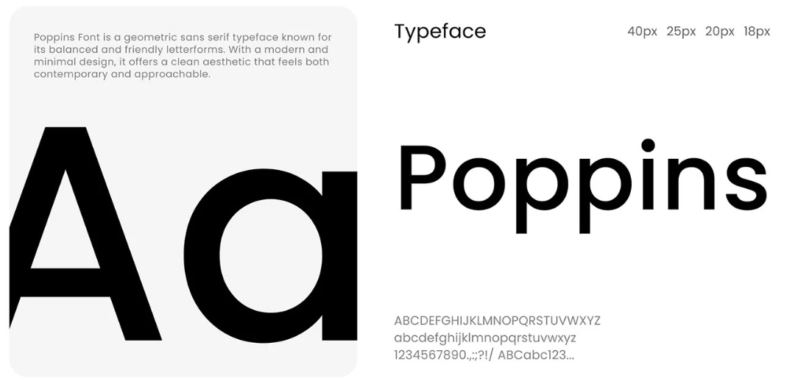
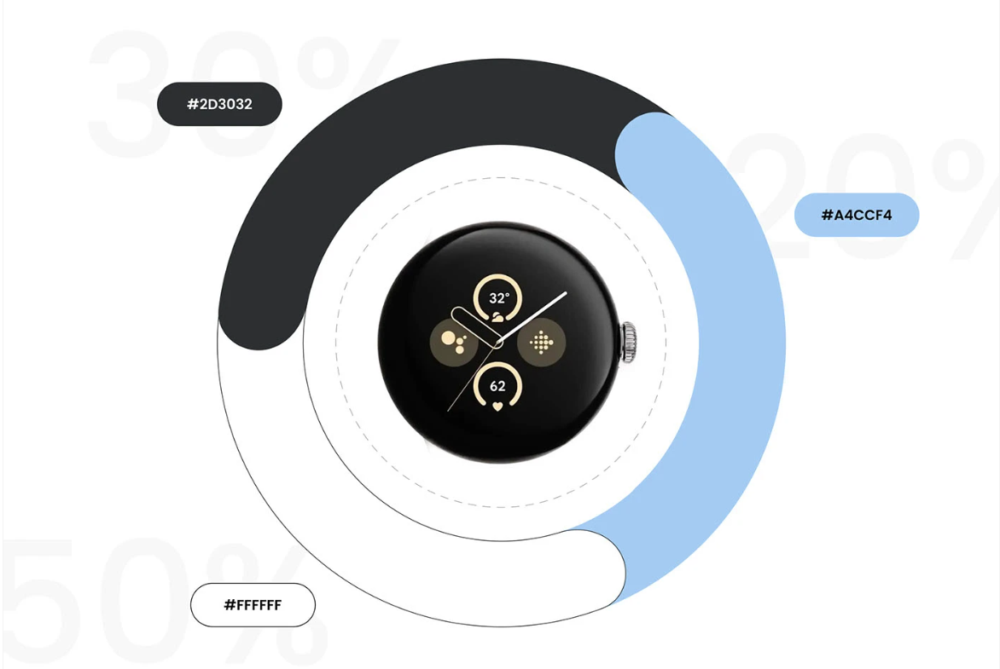

# ⌚ Google Pixel Watch 2 — Landing Page

A sleek and responsive landing page dedicated to showcasing the **Google Pixel Watch 2** — designed with precision, powered by creativity.  
Built entirely using **Tailwind CSS**, this project reflects a modern approach to web design and clean UI architecture.

Here is a deployed version of the website: https://google-pixel-watch-2-shwetha.vercel.app/
---

## 🚀 Project Overview

This project was built to practice and demonstrate:

- **Tailwind CSS** for styling and responsiveness
- The **index.js** file structure and its purpose in modular React setups
- Consistent **color palette** and **typography** choices for brand coherence
- Smooth layout, minimal components, and a polished product showcase experience

---

## 🎨 Design Highlights

**Typography:**  
Inspired by Google's material design principles — simple, legible, and tech-forward.  

**Color Palette:**  
A balanced blend of vibrant accents reflecting the Pixel aesthetic.  

---

## 🧩 Tech Stack

- **Frontend:** React + Tailwind CSS
- **Build Tool:** Vite / Create React App (depending on setup)
- **Language:** JavaScript

## 💡 What I Learned

- How **Tailwind CSS** can rapidly accelerate UI design
- The purpose and role of an **index.js** file in React — serving as the entry point for rendering and routing
- Building aesthetic consistency through color and typography systems

---

## 🪄 Author

**Created by:** Shwetha A  
A developer exploring creative frontend design with Tailwind and React.

---

> “Design is intelligence made visible.” – Alina Wheeler
